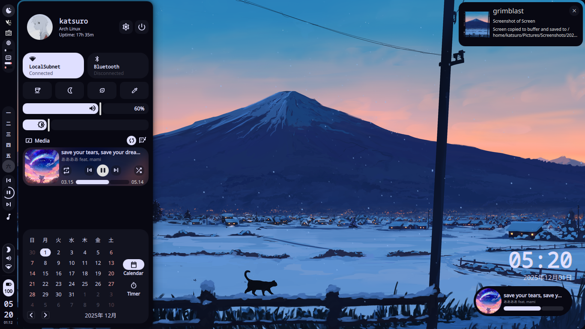
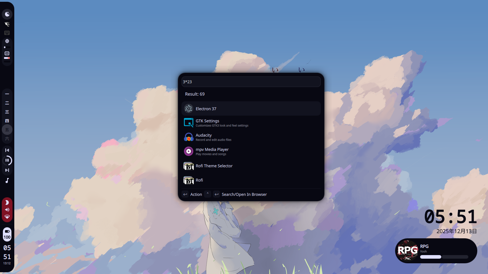
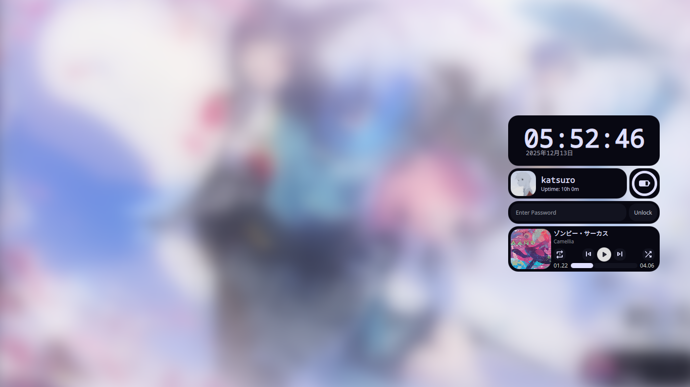

# NullFrameShell

----
A *Modern Desktop* shell built using Quickshell for **Hyprland** Compositor

> [!WARNING]
> Status: indev (Unfinished)
>
> Created in 1366x768 Resolution Monitor

### Component
- [x] Bar 
- [x] On-Screen-Display (volume/brightness/capslock/fcitx5)
- [x] QuickSetting
- [x] Desktop Widget
- [x] Notification Popups
- [x] Lyrics Display
- [x] Power Menu
- [x] Lockscreen
- [x] Launcher

### Planned
- [ ] GUI Setting

## Dependency
- Quickshell
???

